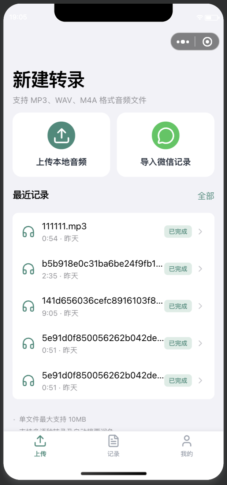
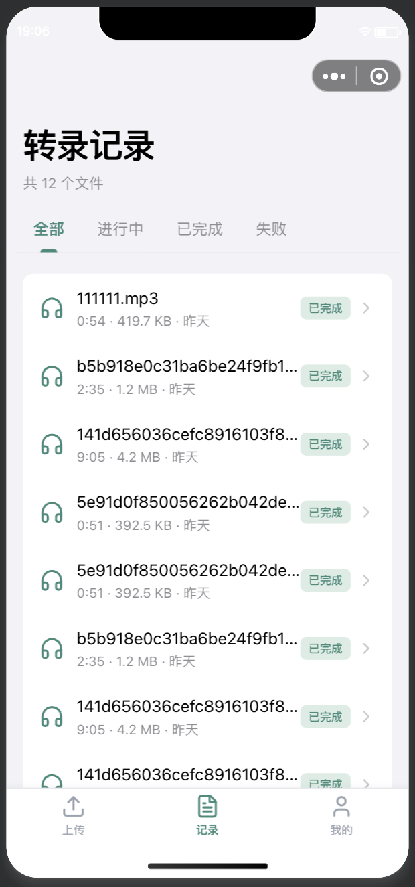
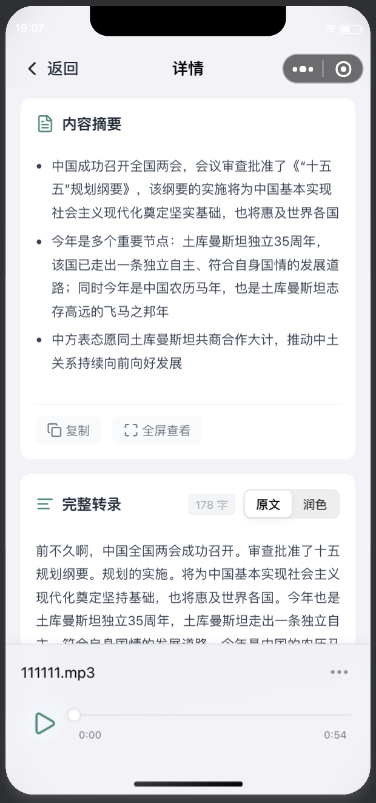
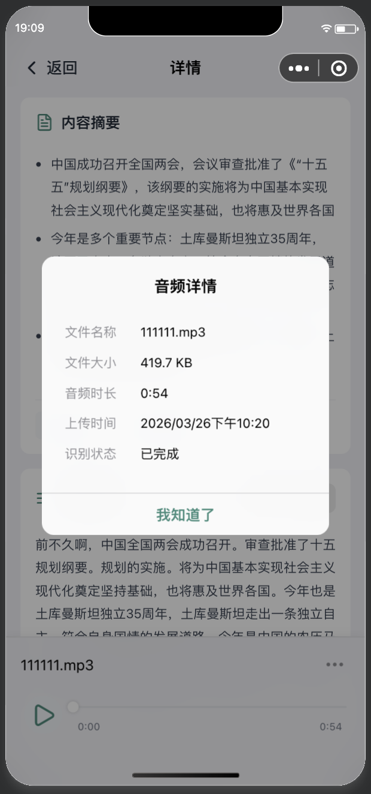
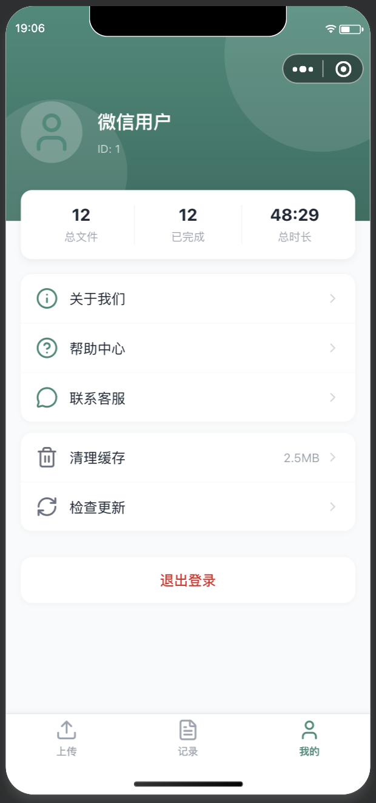

# 音频转录总结小程序

基于 Mpx 框架开发的跨平台小程序，支持音频录制、上传、转录、润色及总结功能。

## 效果图

<table>
  <tr>
    <td align="center">
      
      <br/>
      <sub>上传界面</sub>
    </td>
    <td align="center">
      
      <br/>
      <sub>上传记录界面</sub>
    </td>
    <td align="center">
      
      <br/>
      <sub>转录详情</sub>
    </td>
  </tr>
  <tr>
    <td align="center">
      
      <br/>
      <sub>转录详情</sub>
    </td>
    <td align="center">
      
      <br/>
      <sub>个人中心</sub>
    </td>
    <td></td>
  </tr>
</table>

## 技术栈

- **框架**: [Mpx](https://mpxjs.cn/) - 类 Vue 语法的小程序跨平台开发框架
- **状态管理**: Pinia (@mpxjs/pinia)
- **样式方案**: UnoCSS + 原子化 CSS
- **跨平台支持**: 微信小程序(默认)、支付宝小程序、Web

## 项目结构

```
src/
├── api/                 # API 接口封装
│   ├── auth.js          # 登录/用户信息
│   ├── file.js          # 文件管理
│   ├── oss.js           # 阿里云 OSS
│   └── transcription.js # 转录任务
├── components/          # 组件
│   ├── ui/              # UI 组件库 (button/input/modal/tabs...)
│   ├── icon.mpx         # 图标组件
│   └── list.mpx         # 列表组件
├── pages/               # 页面
│   ├── index/           # 首页(登录跳转)
│   ├── login/           # 登录页
│   ├── upload/          # 音频上传(录制/选择)
│   ├── records/         # 转录记录列表
│   ├── detail/          # 转录详情
│   ├── profile/         # 个人中心
│   └── about/           # 关于
├── stores/              # Pinia 状态管理
│   ├── user.js          # 用户信息/登录状态
│   ├── file.js          # 文件列表
│   └── transcription.js # 转录任务状态
├── utils/               # 工具函数
│   ├── request.js       # HTTP 请求封装
│   └── format.js        # 格式化工具
├── custom-tab-bar/      # 自定义底部导航栏
└── app.mpx              # 应用入口
```

## 核心功能

1. **音频上传**
   - 支持录音直接录制
   - 支持从本地选择音频文件
   - 文件上传至阿里云 OSS

2. **语音转录**
   - 异步转录任务处理
   - 状态流转: pending → processing → completed/failed
   - 支持重新转录

3. **结果查看**
   - 转录原文展示
   - 智能总结（支持 Markdown 渲染）
   - 音频播放控制

4. **用户系统**
   - 微信一键登录
   - 转录记录列表

## 快速开始

```bash
# 安装依赖
pnpm install

# 开发构建 - 微信小程序(默认)
pnpm run serve

# 跨平台开发构建
pnpm run serve:ali      # 支付宝小程序
pnpm run serve:web      # Web

# 生产构建
pnpm run build          # 微信小程序
pnpm run build:ali      # 支付宝小程序
pnpm run build:web      # Web
```

## 多平台构建

```bash
# 同时输出多平台
pnpm run serve -- --targets=wx,ali,web

# 指定其他小程序平台
pnpm run serve -- --targets=swan    # 百度
pnpm run serve -- --targets=tt      # 头条
pnpm run serve -- --targets=qq      # QQ
pnpm run serve -- --targets=jd      # 京东
pnpm run serve -- --targets=ks      # 快手
```

## 相关文档

- [Mpx 文档](https://mpxjs.cn/)
- [小程序框架对比](https://mpxjs.cn/guide/migrate/framework.html)
- [UnoCSS 文档](https://unocss.dev/)
